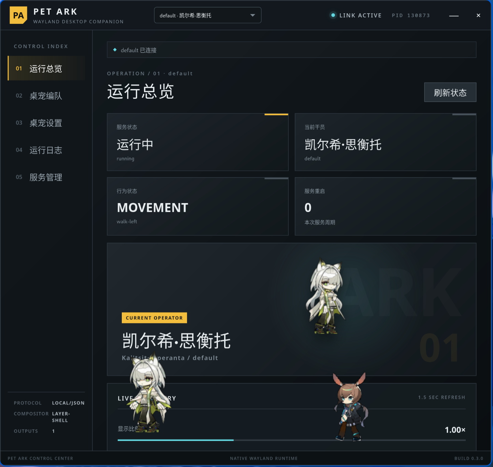

# Pet Ark

原生 Linux Wayland《明日方舟》桌宠。项目包含多桌宠运行时、工业风图形控制中心、933 个外观的资产管线，以及独立的 Codex Pet atlas 工具链。



## 功能

- 原生 C / Wayland 透明桌宠，使用 `wl_shm` 与 layer-shell；
- 425 名干员、933 个默认外观与皮肤，支持 idle、移动、互动、拖动、休息、睡眠与特殊动作；
- 多实例运行，每只桌宠拥有独立进程、配置、systemd unit 与控制 socket；
- Tauri + Svelte 控制中心，在同一窗口切换实例并管理外观、大小、速度、显示器、日志与登录自启；
- niri 工作区/焦点事件响应与桌宠社交事件；
- 增量资产质量索引，当前 933 个外观中 703 个自动通过，230 个进入人工复核队列，critical/high 为 0。

## 快速开始

### 系统依赖

Fedora：

```bash
sudo dnf install gcc make pkgconf-pkg-config wayland-devel libpng-devel \
  webkit2gtk4.1-devel openssl-devel librsvg2-devel
```

Debian / Ubuntu：

```bash
sudo apt install build-essential pkg-config libwayland-dev libpng-dev \
  libwebkit2gtk-4.1-dev libssl-dev librsvg2-dev
```

还需要 Node.js 22+、npm 与 Rust stable。

### 构建与部署

```bash
npm install
npm run standalone:build
npm run standalone:service:install

npm run control:center:install
npm run control:center:build
npm run control:center:deploy
```

安装脚本会立即启动默认桌宠，但保持登录自启关闭。控制中心可从应用菜单打开，也可直接运行：

```bash
standalone/dist/app/bin/pet-ark-control-center
```

启用桌面事件响应：

```bash
systemctl --user start pet-ark-context.service
```

## 多桌宠

控制中心的“桌宠编队”可创建和管理最多 8 个实例。命令行也可操作实例：

```bash
npm run standalone:instance -- create mon3tr-side mon3tr default
npm run standalone:instance -- list
npm run standalone:control -- --instance mon3tr-side status
```

默认实例使用 `pet-ark.service`、`~/.config/pet-ark/runtime.env` 与 `control.sock`；其他实例使用 `pet-ark@<id>.service`、`instances/<id>.env` 与 `<id>.sock`。

## 桌面交互

| 操作 | 效果 |
|---|---|
| 左键 / 拖动 | 互动、抓取与放下 |
| 右键 | 特殊动作 |
| 中键 | 切换自动移动 |
| 滚轮 | 调整显示大小 |
| `SIGUSR1` | 切换点击穿透 |
| `SIGUSR2` | 切换自动移动 |
| `SIGHUP` | 切换下一名干员 |
| `SIGRTMIN` | 切换当前干员的下一套外观 |

niri 事件 broker 会根据工作区切换、应用焦点和社交计时触发 `wake`、`attention`、`celebrate`。设置位于 `pet-ark-context.service` 的环境变量中。

## 项目结构

```text
pet_ark/
├── standalone/       原生桌宠、状态机、Wayland backend 与运行资产
├── control-center/   Tauri / Svelte 图形控制中心
├── codex/            8 × 9 Codex Pet atlas 构建与验证
├── shared/           角色数据、素材获取、导出与质量工具
├── scripts/          部署、实例、控制协议与 context broker
└── docs/             架构、资产与桌面集成文档
```

Standalone 与 Codex atlas 共用角色身份和来源记录，但使用各自独立的资源格式、动画模型和构建流程。详细边界见 [`docs/architecture.md`](docs/architecture.md)。

## 常用开发命令

| 命令 | 用途 |
|---|---|
| `npm run standalone:dev -- --character amiya` | 前台启动桌宠 |
| `npm run standalone:test` | 运行原生状态机与资产测试 |
| `npm run standalone:quality` | 更新增量清晰度/构图索引 |
| `npm run standalone:quality:plan` | 生成候选修复计划 |
| `npm run standalone:build -- --character amiya --skin default` | 重建一个外观 |
| `npm run control:center:check` | 检查 UI、类型与设计令牌 |
| `npm run control:center:dev` | 开发模式运行控制中心 |
| `npm run codex:build -- --character amiya` | 构建一个 Codex Pet |

完整资产构建和 coverage 命令见 [`docs/character-assets.md`](docs/character-assets.md)。

## 文档

- [`docs/control-center.md`](docs/control-center.md)：控制中心、实例上下文与部署；
- [`docs/control-center-design-system.md`](docs/control-center-design-system.md)：集中式 UI 设计令牌和组件规则；
- [`docs/multi-pet-desktop-integration.md`](docs/multi-pet-desktop-integration.md)：多实例与桌面事件；
- [`docs/asset-quality-pipeline.md`](docs/asset-quality-pipeline.md)：增量清晰度修复；
- [`docs/wayland.md`](docs/wayland.md)：Wayland backend 与 compositor 支持；
- [`THIRD_PARTY_NOTICES.md`](THIRD_PARTY_NOTICES.md)：来源、许可与第三方声明。

## 致谢与权利说明

- [PRTS Wiki](https://prts.wiki/) 提供干员资料索引与公开 `char_spine` 资源入口；PRTS 站点文字内容采用 CC BY-NC-SA 4.0，站内游戏素材权利归上海鹰角网络科技有限公司及其关联公司；
- [ArknightsGameData](https://github.com/Kengxxiao/ArknightsGameData) 用于角色 ID 与 alter 分组核对；
- [Aceship/Arknight-Images](https://github.com/Aceship/Arknight-Images) 用于 Codex 角色视觉索引核对；
- [wayland-protocols](https://gitlab.freedesktop.org/wayland/wayland-protocols) 与 [wlr-protocols](https://gitlab.freedesktop.org/wlroots/wlr-protocols) 提供协议定义。

Pet Ark 是非官方同人项目。《明日方舟》名称、角色与游戏素材的权利归其各自权利人所有。项目自有代码使用 [MIT License](LICENSE)；该许可不覆盖第三方游戏素材。逐项来源见 [`THIRD_PARTY_NOTICES.md`](THIRD_PARTY_NOTICES.md)。
